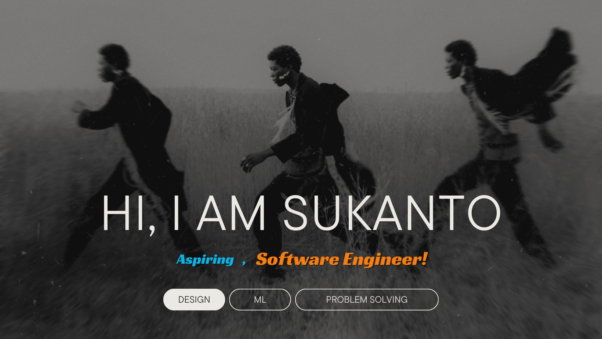

## Technologies that I know

  

## Programming Languages:

  

# Current overview
- 🔭 I am currently a CSE undergraduate at the University of Dhaka.
- 🌱 I’m currently learning NextJS
- 👯 I’m looking to collaborate on open source project
- 💬 Love to talk about technology

## Current Stats

  

  

